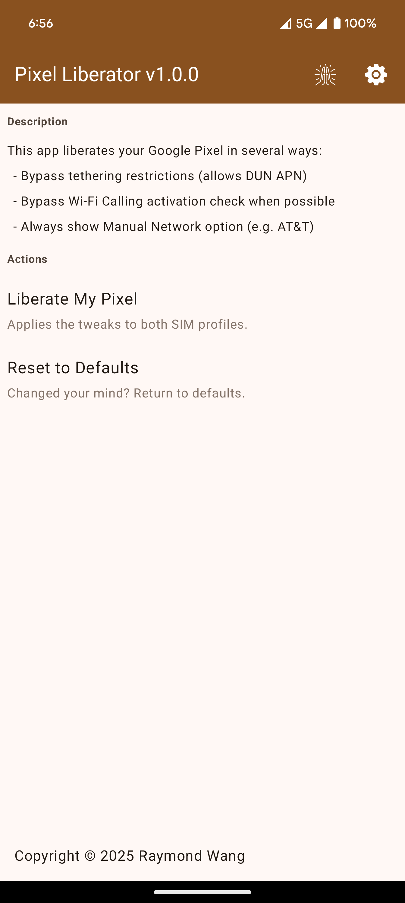

## Description

This app liberates your Google Pixel from the shackles of carrier control.

Specifically,

- Bypasses tethering restrictions (allows use of DUN APNs)

- Bypasses Wi-Fi Calling activation check (when possible, e.g. UScellular)

- Force allow Manual Network Selection on any SIM (some carriers such as AT&T blocks this feature otherwise)

## Demo

### Video

### Images

## Prerequisites

Shizuku is required to use this app.
 
## Notes

Tested and verified working on Pixel 8 Pro, Pixel 9 Pro Fold (official Android 16 update), Motorola Edge 2022, Motorola Edge 2024

Does not work on Samsung S24 Ultra (use CSC method instead), or OnePlus 13.

## Credits

- Special thanks to Kyujin Cho for Pixel IMS - the base of which I used to build this app

- Google for the Android Open Source Project; thanks for inspiring me to break through the shackles
